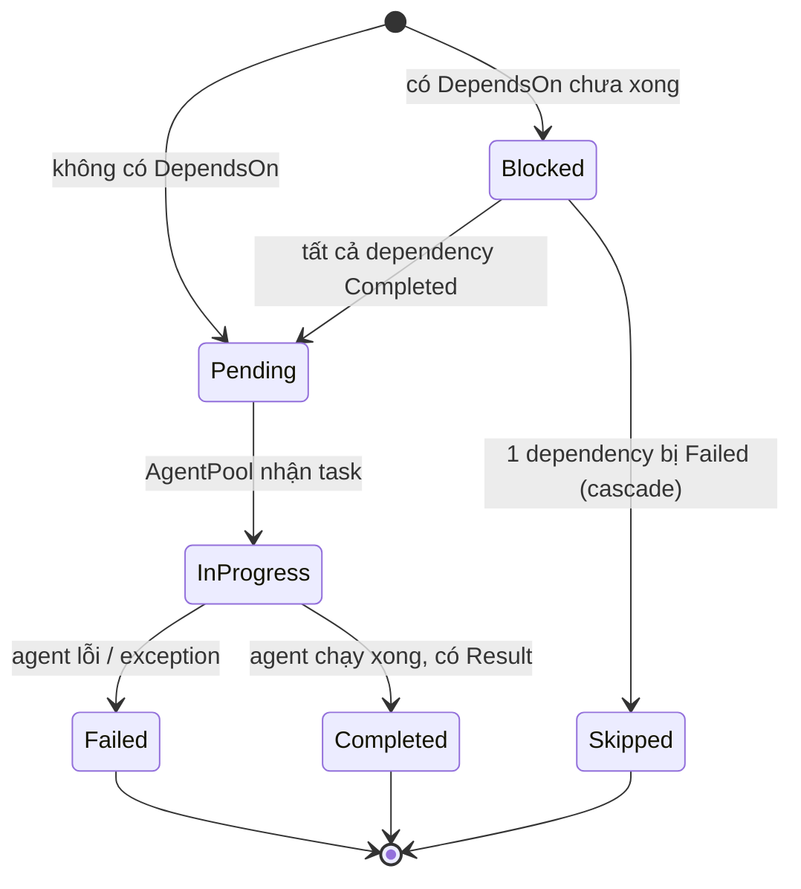
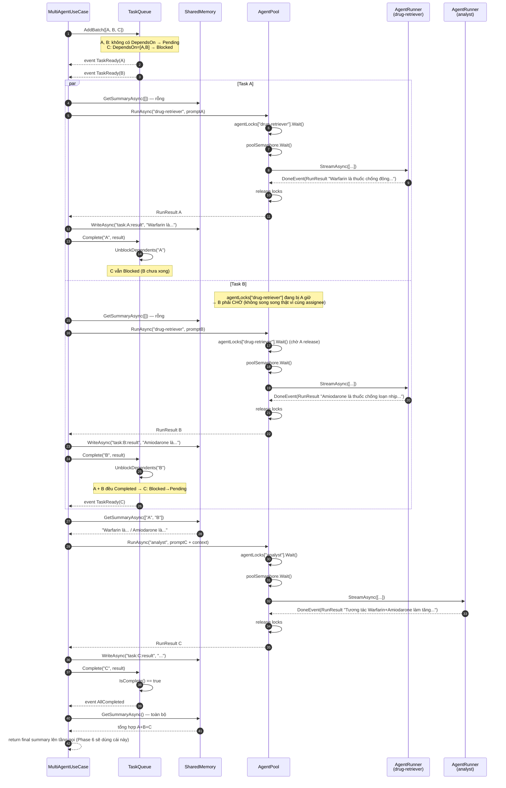
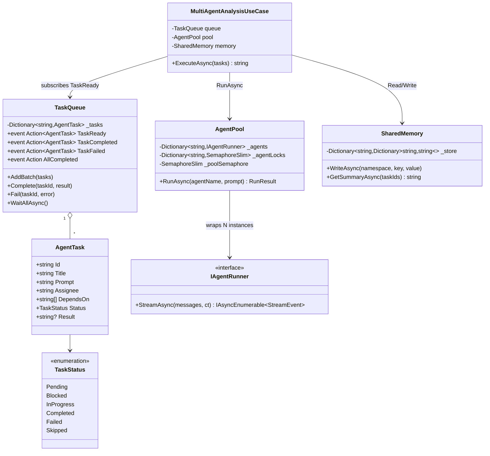

# Phase 6 — Multi-Agent: Giải thích chi tiết + Sequence Diagram + Kế hoạch implement

> Tài liệu học tập, đi kèm [pharma-ai-assistant-plan.md](./pharma-ai-assistant-plan.md).
> Mục tiêu: hiểu **tại sao** thiết kế thế này trước khi viết code, không chỉ hiểu **cái gì**.

---

## 1. Tại sao cần multi-agent (so với Phase 1-4 hiện có)

Hiện tại bạn có **1 agent duy nhất** (`AgentRunner`, Infrastructure/Services) chạy vòng lặp tuần tự:

```
LLM nghĩ → gọi tool (search_drug / list_drug_classes) → nhận kết quả
  → LLM nghĩ tiếp → gọi tool tiếp (nếu cần) → ... → trả lời cuối
```

Đây gọi là **ReAct loop** (Reason + Act) — pattern rất phổ biến, đủ dùng cho câu hỏi đơn giản. Nhưng nó có 2 giới hạn:

1. **Tuần tự (sequential)**: Nếu câu hỏi cần tra cứu N thứ độc lập (VD: "Warfarin tương tác Amiodarone thế nào ở bệnh nhân suy thận?" → cần tra Warfarin, tra Amiodarone, tra suy thận+Warfarin — 3 việc không phụ thuộc nhau), agent vẫn gọi tool **từng cái một**, đợi cái trước xong mới gọi cái sau. Chậm.
2. **1 context window dùng chung cho tất cả**: Toàn bộ lịch sử hội thoại + kết quả tool dồn vào 1 conversation. Càng nhiều tool call, context càng phình to, agent càng dễ "lạc" (mất focus vào câu hỏi gốc), hoặc chạm giới hạn token.

**Multi-agent giải quyết bằng cách chia nhỏ việc thành các "task" độc lập, giao cho các "agent con" chuyên biệt, chạy song song khi không phụ thuộc nhau, rồi 1 bước tổng hợp lại.** Đây là pattern **orchestrator–worker**, dùng bởi LangGraph, AutoGen, và chính nghiên cứu multi-agent của Anthropic mà file plan gốc lấy cảm hứng.

> **Điểm mấu chốt cần nhớ**: multi-agent **không phải là 1 kỹ thuật LLM mới**. Bản chất vẫn là các `AgentRunner` (ReAct loop) bạn đã có ở Phase 1-4, chỉ khác là có thêm 1 lớp **điều phối (orchestration)** bên ngoài để chạy nhiều instance đó song song + có kỷ luật (dependency, concurrency limit, chia sẻ kết quả).

---

## 2. 3 thành phần cốt lõi — vai trò từng cái

Ẩn dụ: một **team lead giao việc cho nhân viên**.

| Thành phần | Vai trò | Ẩn dụ |
|---|---|---|
| `TaskQueue` | Quản lý **danh sách việc cần làm** + thứ tự phụ thuộc | Bảng Kanban, thẻ việc nào phụ thuộc thẻ nào |
| `AgentPool` | Quản lý **ai làm việc gì**, giới hạn bao nhiêu người làm cùng lúc | HR + phòng họp có giới hạn ghế |
| `SharedMemory` | Nơi các agent **đọc/ghi kết quả chung** | Google Doc chung cả team cùng edit |

Không có 3 thành phần này thì mỗi agent chạy độc lập, không biết agent khác tìm ra gì, và không kiểm soát được bao nhiêu LLM call chạy đồng thời (dễ làm quá tải Ollama local hoặc dính rate-limit).

### 2.1 `TaskQueue` — quản lý dependency graph

```csharp
record AgentTask(string Id, string Title, string Prompt, string Assignee,
                  IReadOnlyList<string> DependsOn, TaskStatus Status, string? Result);
```

Mỗi `AgentTask` = 1 việc cụ thể giao cho 1 **loại agent** (`Assignee`, VD `"drug-retriever"`, `"analyst"`). `DependsOn` = các `Id` phải xong trước.

**State machine của `TaskStatus`:**



**Cơ chế "auto-unblock" (event-driven, không phải batch theo layer):** khi task A hoàn thành, `TaskQueue` rà soát các task đang `Blocked`, nếu tất cả dependency của task đó đã `Completed` → chuyển `Pending`, bắn event `TaskReady`. Nhờ đó A và B (không phụ thuộc nhau) chạy song song ngay, còn C (phụ thuộc cả A+B) tự "tỉnh dậy" đúng lúc cả 2 xong — không cần tính trước toàn bộ thứ tự (topological sort tĩnh).

**Cascade failure:** nếu A fail, mọi task phụ thuộc A (trực tiếp/gián tiếp) tự động → `Skipped`, tránh bị treo mãi ở `Blocked` (deadlock).

### 2.2 `AgentPool` — kiểm soát concurrency

```csharp
Dictionary<string, IAgentRunner> _agents;           // "drug-retriever" -> agent instance
Dictionary<string, SemaphoreSlim> _agentLocks;       // 1 loại agent chỉ chạy 1 task tại 1 thời điểm
SemaphoreSlim _poolSemaphore;                        // giới hạn tổng số LLM call đồng thời
```

**Tại sao 2 lớp semaphore (double lock)?**

- `_agentLocks[agentName]` — đảm bảo **cùng 1 loại agent** không chạy 2 task song song (tránh race condition nếu agent giữ state nội bộ, dễ debug/log hơn).
- `_poolSemaphore` — giới hạn **tổng LLM call đồng thời toàn hệ thống**, bất kể loại agent. Đây là giới hạn tài nguyên vật lý: Ollama local chạy trên 1 GPU/CPU, quá nhiều request cùng lúc → chậm tất cả hoặc OOM.

> ⚠️ **Hệ quả cần lưu ý**: nếu 2 task cùng `Assignee` (VD: cả A và B đều `drug-retriever`), chúng **không chạy song song thật** vì bị `_agentLocks["drug-retriever"]` chặn tuần tự — dù `TaskQueue` bắn `TaskReady` cho cả 2 cùng lúc. Đây là quyết định thiết kế cần cân nhắc ở §5.

### 2.3 `SharedMemory` — cách agent "giao tiếp" gián tiếp

Agent **không gọi trực tiếp lẫn nhau**. Thay vào đó:

1. Agent chạy xong task → ghi kết quả vào `SharedMemory` theo key (VD `task:A:result`)
2. Task tiếp theo (phụ thuộc task đó) khi bắt đầu → đọc summary từ `SharedMemory` của các task nó `DependsOn`, nhét vào prompt làm context

```csharp
var context = await memory.GetSummaryAsync(task.DependsOn);
var prompt  = $"{task.Prompt}\n\nContext:\n{context}";
```

Khác biệt lớn so với multi-turn chat hiện có (windowed summarization ở `StreamMessageHandler`): mỗi agent con chỉ nhận **đúng phần context nó cần**, không phải toàn bộ lịch sử — sạch hơn, ít nhiễu, không bị giới hạn context window vì phải nhớ mọi thứ.

---

## 3. Sequence Diagram — luồng chạy end-to-end

Ví dụ dùng đúng use case trong plan gốc: *"Bệnh nhân suy thận đang dùng Warfarin, thêm Amiodarone có an toàn không?"*

```
Task A: "Tìm thông tin Warfarin"     assignee=drug-retriever   dependsOn=[]
Task B: "Tìm thông tin Amiodarone"   assignee=drug-retriever   dependsOn=[]
Task C: "Phân tích tương tác A+B"    assignee=analyst          dependsOn=[A, B]
```



**Đọc diagram này thế nào:** khối `par ... and ... end` nghĩa là 2 nhánh *được kích hoạt cùng lúc* bởi `TaskQueue`, nhưng bên trong nhánh B có 1 note quan trọng: vì cùng `Assignee="drug-retriever"`, `AgentPool` sẽ serialize (chạy tuần tự) 2 task này qua `agentLocks`. Đây không phải bug — là hệ quả trực tiếp của thiết kế "1 lock per agent-type" ở §2.2. Nếu bạn muốn A và B chạy song song *thật*, cần đổi thiết kế (xem §5, câu hỏi 3).

---

## 4. Component diagram — quan hệ giữa các class



**Điểm quan trọng nhất trong diagram này**: `AgentPool` không tự implement logic gọi LLM — nó **wrap các `IAgentRunner` đã có sẵn từ Phase 2** (`Pharma.AiAssistant.Infrastructure/Services/AgentRunner.cs`). Bạn **không viết lại ReAct loop từ đầu** — chỉ viết thêm lớp điều phối bên ngoài.

---

## 5. Câu hỏi thiết kế cần chốt trước khi code

| # | Câu hỏi | Vì sao quan trọng | Đề xuất cho bản đầu tiên (đơn giản nhất) |
|---|---|---|---|
| 1 | Task list đến từ đâu? LLM tự sinh (Coordinator, Phase 6) hay hard-code để test Phase 5 độc lập? | Phase 5 và Phase 6 là 2 việc tách biệt — trộn vào sẽ khó debug cái nào sai | Hard-code task list trong 1 unit test / console runner trước, chưa cần Coordinator |
| 2 | Mỗi "agent type" khác nhau ở đâu — chỉ prompt hay cả tool subset? | `AgentPool` cần biết cách khởi tạo từng loại agent | Tạo `AgentDefinition(Name, SystemPrompt, AllowedToolNames[])`, build `IAgentRunner` tương ứng lúc DI |
| 3 | Có cho 2 task cùng `Assignee` chạy song song thật không? | Ảnh hưởng trực tiếp tốc độ — xem note ở sequence diagram §3 | **Bản đầu tiên: giữ nguyên (tuần tự theo assignee)** — đơn giản, ít race condition. Tối ưu sau nếu cần |
| 4 | `IAgentRunner.StreamAsync` trả `IAsyncEnumerable<StreamEvent>` (streaming), nhưng `AgentPool.RunAsync` cần `RunResult` (đợi xong) — convert thế nào? | Không muốn đổi kiến trúc `IAgentRunner` hiện có | Viết 1 helper "drain" toàn bộ stream, lấy `DoneEvent.Result` — không stream sub-agent lên UI, chỉ stream response tổng hợp cuối (Phase 6) |
| 5 | Lưu tiến trình vào DB hay chỉ chạy trong memory của 1 request? | Ảnh hưởng khả năng resume / theo dõi tiến độ multi-agent như 1 "job" | **Bản đầu tiên: in-memory, sống trong 1 request** — không cần persistence, đơn giản hoá tối đa |
| 6 | Giới hạn `_poolSemaphore` bao nhiêu? | Phụ thuộc tài nguyên máy chạy Ollama | Bắt đầu = 2, benchmark thử rồi chỉnh |

---

## 6. Kế hoạch implement — theo step nhỏ, có verify

Nguyên tắc: Domain trước (pure logic, dễ unit test không cần LLM thật), rồi mới nối vào Infrastructure/Application.

### Step 1 — Domain: `AgentTask` + `TaskStatus`
- Tạo `Pharma.AiAssistant.Domain/Ai/MultiAgent/AgentTask.cs`, `TaskStatus.cs`
- **Verify**: build thành công, chỉ là record/enum, không có logic.

### Step 2 — Domain: `TaskQueue` (không đụng tới LLM/agent thật)
- Implement dependency graph, `AddBatch`, `Complete`, `Fail`, auto-unblock, cascade failure, các event
- **Verify**: viết unit test thuần Domain — dựng task A, B (không dependency), C (dependsOn=[A,B]):
  - `Complete("A", ...)` → assert C vẫn `Blocked`
  - `Complete("B", ...)` → assert C chuyển `Pending`, event `TaskReady(C)` bắn đúng 1 lần
  - Test riêng cascade: `Fail("A", ...)` → assert C chuyển `Skipped`
  - Không cần Ollama/Qdrant chạy — đây là lý do làm Domain trước, feedback loop nhanh

### Step 3 — Domain: `SharedMemory`
- `WriteAsync(namespace, key, value)`, `GetSummaryAsync(taskIds?)` — bản đầu tiên: đơn giản là nối string, chưa cần LLM summarize
- **Verify**: unit test — write 2 key, `GetSummaryAsync(["A","B"])` trả đúng nội dung cả 2, `GetSummaryAsync()` (không tham số) trả toàn bộ

### Step 4 — Application: `AgentDefinition` + cách build nhiều `IAgentRunner`
- Quyết định câu hỏi #2 ở §5 trước khi viết
- Có thể tái dùng `AgentRunner` hiện tại nếu nó đã nhận `ChatOptions` (system prompt, tool list) qua constructor/tham số — kiểm tra lại xem `ChatOptions` hiện tại có per-call override được không, hay đang là 1 singleton dùng chung cho toàn service (nếu là singleton, cần refactor nhẹ để mỗi `AgentDefinition` build được instance riêng)

### Step 5 — Infrastructure: `AgentPool`
- Implement double-semaphore, `RunAsync(agentName, prompt)` — bên trong "drain" `IAgentRunner.StreamAsync` thành `RunResult` (câu hỏi #4)
- **Verify**: integration test nhỏ với 1 fake `IAgentRunner` (không gọi Ollama thật) — assert 2 task cùng `agentName` chạy tuần tự (dùng `Task.Delay` giả lập + kiểm tra thứ tự hoàn thành), 2 task khác `agentName` chạy chồng lấn thời gian

### Step 6 — Application: `MultiAgentAnalysisUseCase`
- Nối `TaskQueue` (event `TaskReady`) → `AgentPool.RunAsync` → `SharedMemory.WriteAsync` → `queue.Complete`
- **Verify**: chạy end-to-end với `IAgentRunner` **thật** (Ollama local), task list hard-code đúng ví dụ ở §3 (Warfarin/Amiodarone/Phân tích) — log thấy đúng thứ tự events như sequence diagram, `GetSummaryAsync()` cuối cùng có nội dung hợp lý

### Step 7 — Verify toàn Phase 5
- Chạy lại đúng kịch bản "Verify Phase 5" trong plan gốc: A, B chạy (tuần tự do cùng assignee — đã biết trước, không phải bug), C tự unblock đúng lúc, có context từ SharedMemory
- Đối chiếu: nếu muốn A/B song song thật, quay lại quyết định #3 ở §5, refactor `AgentPool` sau khi đã chắc luồng cơ bản chạy đúng

**Chưa làm ở Phase 5** (để dành Phase 6): chưa có endpoint API, chưa có Coordinator sinh task list tự động từ câu hỏi tự nhiên — Phase 5 verify bằng task list hard-code là đủ.

---

## 7. Tóm tắt 1 câu cho mỗi thành phần (để nhớ nhanh)

- **`TaskQueue`** = "ai được chạy tiếp theo, dựa trên ai vừa xong" (dependency graph + event)
- **`AgentPool`** = "chạy task đó bằng agent nào, giới hạn bao nhiêu cái chạy cùng lúc" (wrap `IAgentRunner` có sẵn)
- **`SharedMemory`** = "kết quả của task trước truyền cho task sau bằng cách nào" (thay thế conversation history dài)
