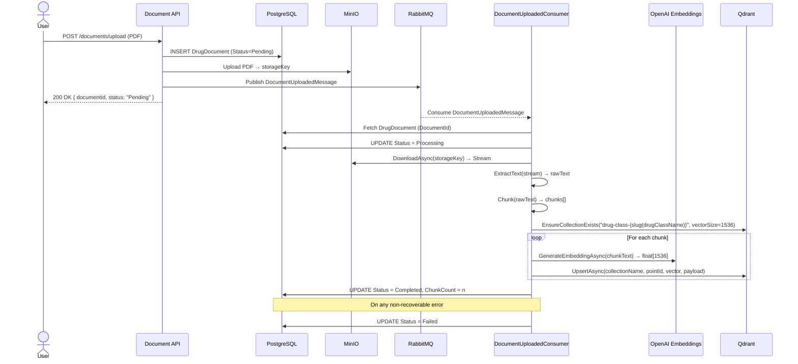
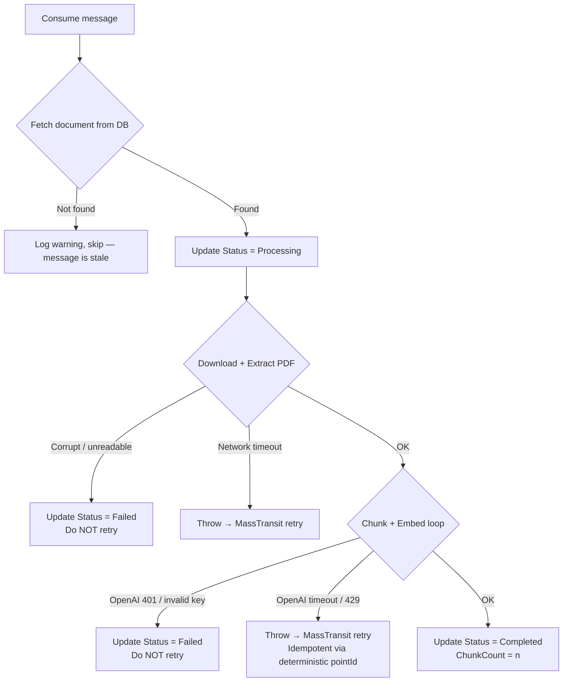

# RAG Document Processing Plan

## Overview

When a user uploads a PDF document, the system saves it to MinIO and publishes a `DocumentUploadedMessage` to RabbitMQ. A consumer picks up the message and runs the full RAG processing pipeline: extract text → chunk → embed → store in vector store.

The HTTP upload response returns immediately with `Status: Pending`. Processing happens fully asynchronously.

---

## Workflow Diagram



---

## Processing Pipeline Detail

### Step 1 — Update Status: Processing
Before any work begins, mark the document as `Processing` so the UI can reflect the current state.

### Step 2 — Download PDF from MinIO
Use `IFileStorageService.DownloadAsync(storageKey)` to get the PDF stream. The `storageKey` comes directly from the message payload.

### Step 3 — Extract Text
Use `IPdfTextExtractor.ExtractText(stream)` to get raw text from the PDF.

> Non-recoverable if the PDF is corrupt or unreadable — catch this exception, update `Status = Failed`, and do not rethrow.

### Step 4 — Chunk Text
Use `ITextChunkingService.Chunk(text, maxTokens: 512, overlapTokens: 100)`.

**Why overlap?** A sentence split across two chunks loses context. Without overlap, a query spanning the boundary of two chunks may match neither:

```
No overlap (BAD):
  Chunk 1: "...Metformin max dose is 2550mg"
  Chunk 2: "per day in adults. For patients with renal impairment"
  Chunk 3: "(eGFR 30-45), dose should be reduced to 1000mg..."

  → Query "Metformin renal impairment dose" matches no complete chunk
```

```
With overlap (GOOD):
  Chunk 1: [token 1   → token 512]
  Chunk 2: [token 413 → token 924]   ← 100-token overlap with Chunk 1
  Chunk 3: [token 825 → token 1336]  ← 100-token overlap with Chunk 2
```

**Why 100 tokens, not 50?**

100 tokens ≈ 5–6 sentences ≈ ~20% of chunk size (512). This is the recommended range for technical/medical documents.

Pharma documents have long, conditional sentences:
> *"For patients with hepatic impairment (Child-Pugh B or C), dose adjustment is recommended when co-administered with CYP3A4 inhibitors..."*

A single such sentence can be 40–60 words. Overlap of 50 tokens (~2–3 sentences) risks cutting through a dosage instruction mid-context. 100 tokens provides a safer margin.

| Overlap | % of chunk | Suitable for |
|---------|-----------|--------------|
| 50 tokens | ~10% | General text, short sentences |
| **100 tokens** | **~20%** | **Technical/medical docs ← this app** |
| 200 tokens | ~40% | Dense legal/scientific text |

> **Note:** These values are empirical starting points. The correct approach is to run retrieval evaluation on actual pharma documents and tune `overlapTokens` based on measured recall. 100 is a reasonable default to begin with.

### Step 5 — Ensure Qdrant Collection Exists

```
Collection name : "drug-class-{slug(drugClassName)}"   e.g. "drug-class-beta-lactam-antibiotics"
Vector size     : 1536  (OpenAI text-embedding-3-small)
```

One collection per drug class. Created on-demand via `EnsureCollectionExistsAsync` before upserting.

**Collection name slug rule:** lowercase + replace non-alphanumeric characters with hyphens + trim.
```
"Beta-Lactam Antibiotics" → "drug-class-beta-lactam-antibiotics"
"Anti-Inflammatory"       → "drug-class-anti-inflammatory"
```

Using `drugClassName` (not `drugClassId`) keeps collection names human-readable in Qdrant UI and logs. UUID v7 would produce unreadable names like `"drug-class-01KSZYYYYYYYYYYYYYYY"`.

#### Design Decision: Multiple Collections (one per DrugClass)

**This was revised after deeper analysis.** The initial approach of one shared `"drug-documents"` collection is Qdrant's recommendation for multi-tenant SaaS with millions of small tenants. For this app, multiple collections per drug class is the better fit.

---

**Why multiple collections win here:**

The core issue with a single collection + payload filtering is **HNSW index dilution**.

HNSW (Hierarchical Navigable Small World) is a graph-based algorithm. It works by navigating graph edges to reach the nearest vectors. In a single collection, the graph links vectors across all drug classes:

```
[Metformin chunk] → [Amoxicillin chunk] → [Ibuprofen chunk] → ...
```

When filtering to only `antibiotics`, the graph traversal must skip irrelevant nodes. If the filter is restrictive (antibiotics = 10% of total data), HNSW degrades toward a brute-force scan. This is called **index dilution**.

With per-class collections:
```
collection "drug-class-antibiotics": [Amoxicillin] → [Penicillin] → [Azithromycin] → ...
```

The HNSW graph is fully optimized for that subset — no dilution, no skipping, maximum search speed.

---

**When to use single collection vs multiple collections:**

| Scenario | Recommended approach |
|---|---|
| Millions of tenants, each with a few vectors (e.g., user-level notes app) | Single collection + payload filter |
| Tens to hundreds of large categories, each with thousands of vectors | **Multiple collections** ← this app |

**Pharma app profile:**
- Drug classes: ~20–50 (bounded, not millions)
- Chunks per class: potentially tens of thousands
- Query pattern: almost always scoped to one drug class

→ Fits squarely in the "multiple collections" scenario.

---

**Additional benefit — data lifecycle:**

Deleting all vectors for a drug class = `DROP COLLECTION`. With a single collection, deletion requires a `delete-by-filter` query that triggers an index rebuild — slower and more error-prone.

---

#### Research Notes

**Qdrant docs (official) — context matters:**
> *"Storing data in one collection should work perfectly fine if you define the appropriate payload to separate them using filters when searching. Having many collections instead induces **memory overhead**..."*

This is true when you have thousands of collections with very few vectors each — the memory is wasted on empty HNSW structures. It does NOT mean a single collection always outperforms. The guidance is specifically for high-tenancy (millions of small tenants) scenarios.

**Qdrant multitenancy article:**
> *"Qdrant is built to excel in a single collection with a vast number of tenants."*

Key phrase: **vast number of tenants**. 20–50 drug classes is not that scenario.

**[GitHub Discussion #2914](https://github.com/orgs/qdrant/discussions/2914) — "1 collection 10M points vs 10 collections 1M points":**
> Performance of one large collection is roughly equal to many smaller ones when data size is the same. The difference is in how filtered search degrades with index dilution.

**Gemini analysis (detailed breakdown):**

> *"The 'Pre-Filtering' vs 'Post-Filtering' Problem: If your filter is highly restrictive (e.g., matching only 0.1% of the data), HNSW graph traversal becomes inefficient, forcing an expensive brute-force linear scan. Index Dilution: Your HNSW graph links vectors across different categories. Navigating this 'diluted' graph to find localized nodes can slow down search latency compared to searching a smaller, isolated graph."*
>
> *"Choose Multiple Collections if: You have a few dozen or a few hundred large, distinct datasets (e.g., enterprise clients with gigabytes of data each). The memory overhead is negligible relative to the dataset size, and the search latency will be vastly superior."*

**Sources:**
- [How to Implement Multitenancy and Custom Sharding in Qdrant](https://qdrant.tech/articles/multitenancy/)
- [Best Practices for Massive-Scale Deployments: Multitenancy and Custom Sharding](https://dev.to/qdrant/best-practices-for-massive-scale-deployments-multitenancy-and-custom-sharding-1mjb)
- [Performance: One collection 10M pts vs 10 collections 1M pts — Discussion #2914](https://github.com/orgs/qdrant/discussions/2914)
- [A Complete Guide to Filtering in Vector Search — Qdrant](https://qdrant.tech/articles/vector-search-filtering/)
- [Collections — Qdrant Documentation](https://qdrant.tech/documentation/manage-data/collections/)

---

### Step 6 — Embed + Store (per chunk)
For each chunk:
1. Call `IEmbeddingService.GenerateEmbeddingAsync(chunkText)` → `float[1536]`
2. Call `IVectorStoreService.UpsertAsync(collectionName, pointId, vector, payload)`

**Embedding model:** `text-embedding-3-small` (1536 dimensions).
Chosen for cost-efficiency and sufficient semantic quality for pharma domain retrieval. Upgrading to `text-embedding-3-large` (3072 dims) provides marginal accuracy gains at double the cost — not warranted at this stage.

**Payload stored per chunk:**
```json
{
  "documentId":  "01KSZXXXXXXXXXXXXXXX",
  "chunkIndex":  0,
  "chunkText":   "Metformin maximum dose is 2550mg per day...",
  "fileName":    "metformin-guidelines.pdf",
  "drugName":    "Metformin",
  "drugClassId": "01KSZYYYYYYYYYYYYYYY"
}
```

`chunkText` is stored in the payload so the RAG query response can return the source text directly — no need to re-fetch from MinIO.

**Why deterministic Point ID?**
```
pointId = UuidV5(namespace: DocumentId, name: chunkIndex.ToString())
```

If the consumer crashes mid-loop (e.g., at chunk 50 of 100) and MassTransit retries, the first 50 chunks would be inserted again with new random IDs → **duplicate vectors**. Deterministic IDs make `UpsertAsync` idempotent — retrying is always safe.

### Step 7 — Update Status: Completed
```csharp
document.Status = DocumentStatus.Completed;
document.ChunkCount = chunks.Count;
```

---

## Error Handling Strategy



### Retry Policy (MassTransit)
Configured on `DocumentUploadedConsumer` with exponential backoff:

| Attempt | Delay | Trigger |
|---------|-------|---------|
| 1st retry | 5 seconds | Network/timeout errors |
| 2nd retry | 30 seconds | |
| 3rd retry | 2 minutes | |
| Give up | — | Move to error queue |

**Retry (throw exception):** transient network errors, OpenAI rate limit (429), Qdrant connection drop.

**No retry (catch + Status=Failed):** corrupt PDF, document not found in DB, authentication errors (401/403).

---

## Qdrant Data Model

```
Collection: "drug-class-{slug(drugClassName)}"   (one per drug class)
│
├── Point { id: uuid-v5, vector: float[1536], payload: { documentId, chunkIndex, chunkText, fileName, drugName, drugClassId } }
├── Point { id: uuid-v5, vector: float[1536], payload: { ... } }
└── ...

Query example (future RAG):
  → search in collection "drug-class-beta-lactam-antibiotics"
  → nearest vectors to query embedding
  → return: chunkText from payload  ← source passage for LLM context
```

No cross-collection filtering needed at query time — the collection name itself is the scope.

---

## Files To Implement

| File | Description |
|------|-------------|
| `Consumers/DocumentUploadedConsumer.cs` | Main consumer — orchestrates the pipeline |
| `Infrastructure/DependencyInjection.cs` | Register consumer + retry policy |
| `Services/IFileStorageService.cs` | Already has `DownloadAsync` ✓ |
| `Services/IPdfTextExtractor.cs` | Already defined ✓ |
| `Services/ITextChunkingService.cs` | Already defined ✓ |
| `Services/IEmbeddingService.cs` | Already defined ✓ |
| `Services/IVectorStoreService.cs` | Already defined ✓ |
| `Helpers/DeterministicGuid.cs` | UuidV5 helper for chunk point IDs |
